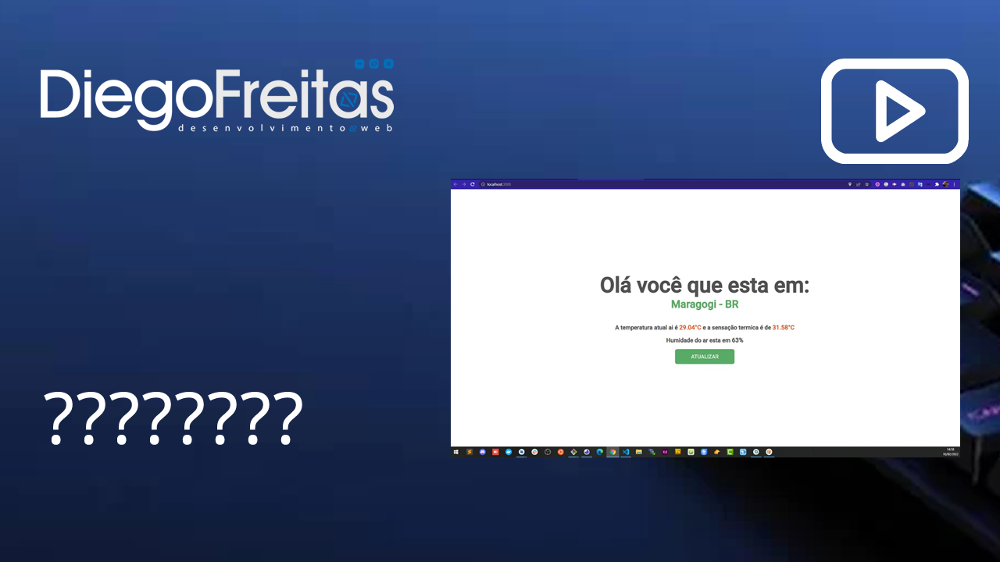
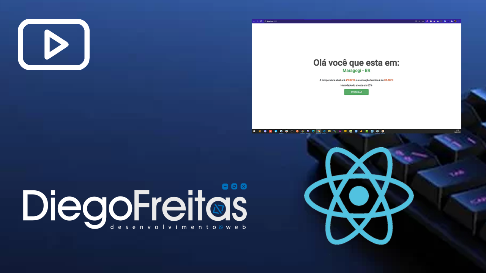

# Print do projeto final

# Sobre

Esta aplicação foi desenvolvida para atender um teste técnico, solicitado por uma empresa, foi desenvolvido usando [React](https://pt-br.reactjs.org)

## Rodar local
 Execute os comandos abaixo:

```sh
git clone git@github.com:diegozfreitas/previsao-tempo.git tempo
cd tempo
npm install ou yarn
npm run start ou yarn start
```

## Link online desse projeto em funcionamento

Para ver este projeto online [clique aqui](https://previsao-tempo-seven.vercel.app)

## Prints do projeto


# Video sobre o projeto

<a href="https://youtu.be/v5ve8VoWJaw" target="_blank">
    
</a>

# Video técnico sobre o projeto

<a href="https://youtu.be/K0hjhDkLzQ0" target="_blank">
    
</a>

